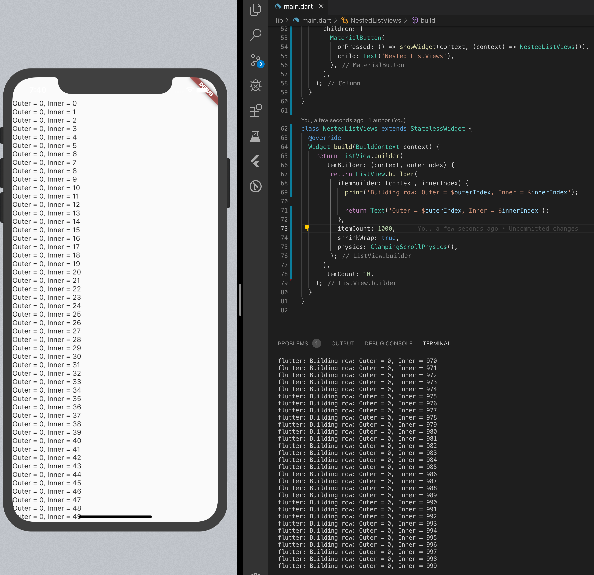
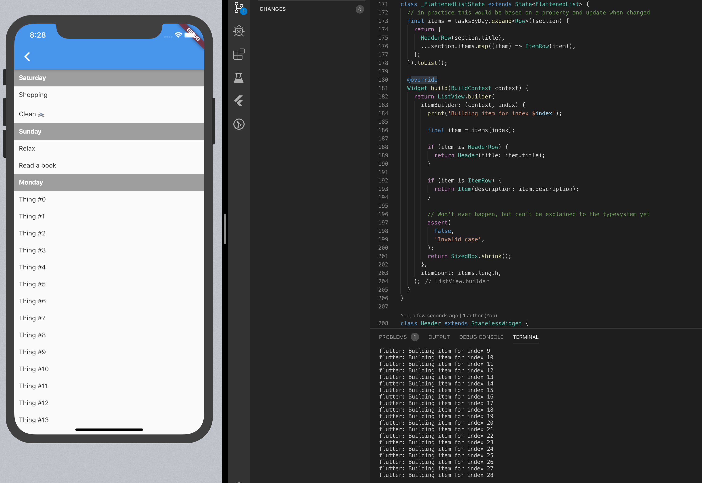

# Nested `ListView`s in Flutter

If you've ever tried rendering a simple `ListView` inside the `itemBuilder` method of another `ListView` you'll most certainly have encountered the _Vertical viewport was given unbounded height._ exception.

The simple fix (which ranks up top on Google) is to add the `shrinkWrap: true` property to the inner `ListView`s. Once that is changed the initial screen renders fine, until you try to scroll the overall list, which is not possible because any drag actions on top of the inner `ListView`s just scrolls them (even though they might be "fully" rendered). The fix for that issue is then to add `physics: ClampingScrollPhysics()` to the innner `ListView`s.

With those 2 lines added to the inner `ListView` the initial issue is solved and one might consider it done. I would like to disagree and suggest some alternatives. In this I'll article explain why there is no need to nest `ListView`s in the first place, how nesting them can be misleading about their performance characteristics (which are bad in practice), and how `SliverList` is a better approach should you ever have the need to render multiple list below one another.

<div class="note">The demo app and code for each approach is available on <a href="https://github.com/tp/nested_listviews">GitHub at tp/nested_listviews</a>.</div>


## Performance characteristics of nested `ListView`s

All of the nested `ListView` code I have seen in the wild recently used the seemingly performant [`ListView.builder` constructor](https://api.flutter.dev/flutter/widgets/ListView/ListView.builder.html) for the outer and inner `ListView`s. So it seems like developers are aware that it exists and should be used, and the documentation clearly states the advantages of it:

> This constructor is appropriate for list views with a large (or infinite) number of children because the builder is called only for those children that are actually visible.

Unfortunately though, that is not true anymore for the inner `ListView`s. Because the outer view needs to know how tall the inner `ListView`s are, the inner ones will get rendered in full until the height is filled. But at the very least the first list view will get rendered in full, which is already bad should that contain many items. This behavior can easily be verified by putting a `print` in the `itemBuilder` of the inner `ListView`:



As you can see in the example above, the 1000 items for the first inner `ListView` were build, even though only 50 are visible on the screen.

Whether or not this is an issue in your application depends on the maximum amount of items in the inner `ListView`s. Just from reading the code one might think though that it behaves efficiently – meaning it really only renders visible items – which it does not. Hence I would find it more _honest_ to use a `Column` and plainly map the items to widgets. Also in the general case that reads nicer than retrieving the item by index from the underlying storage as has to be done with the `itemBuilder`:


```dart
// [... wrapping ListView.builder omitted]
return Column(
  children: <Widget>[
    ...List.generate(
      1000,
      (innerIndex) {
        return Text('Outer = $outerIndex, Inner = $innerIndex');
      },
    ),
  ],
);
```

## The flattened list approach

So far we've only seen how a nested `ListView` is as much work to render as a `Column` or a similar widget. One approach I would like to suggest, for most cases, is to _unnest_ the rendering and make do with a single list view. This can be achieved in a variety of ways, but the simple approach of flattening the data structure into a single array should work up to a huge number of items. Just make sure not to compute that flattened array in the `builder` method, but rather once initially and on updates and keep it stored in some state.

Suppose we'd wanted to build a todo app. Let's assume our API returns us a list of sorted groups (for example by day) in some kind of `Section` type:

```dart
@immutable
class Section {
    Section(this.title, this.items);

    final String title;

    final List<String> items;
}
```

Now instead of rendering the outer `ListView` with the `Section`s as items and then an inner `ListView` for each section, we can flatten the `Section`s into a list of `Row`s (a new type we define for this case).

```dart
@immutable
abstract class Row {} // approximation of a union type in Dart

class HeaderRow implements Row {
  HeaderRow(this.title);

  final String title;
}

class ItemRow implements Row {
  ItemRow(this.description);

  final String description;
}


// tasksByDay is a List<Section>
final items = tasksByDay.expand<Row>((section) {
  return [
    HeaderRow(section.title),
    ...section.items.map((item) => ItemRow(item)),
  ];
}).toList();
```

And then that `items` list can be rendered with a single `ListView` which renders a specific widget dependening on each item's type:

```dart
ListView.builder(
  itemBuilder: (context, index) {
    final item = items[index];

    if (item is HeaderRow) {
      return Text(item.title,
          style: TextStyle(fontWeight: FontWeight.bold));
    }

    if (item is ItemRow) {
      return Text(item.description);
    }
  },
  itemCount: items.length,
);
```

With this approach a little upfront work is required, but then only the rows visbile on screen (+ some small amount of extra rows rendered by the framework) are built:



## `SliverList`s inside a `CustomScrollView`

The above approach of flattening the list is in my opinion a good approach to render such a grouped list view, but it's only suitable for lists that have few row types. Should you ever have the need to render lists from different domains in a single list, then a `CustomScrollView` with `SliverList`s for each specific type of list seem like a better approach in my opinion. I'll write up an explanation and code example on those in a follow up post.

## Recap

I hope I was able to show how nesting `ListView`s inside one another might not be a good idea for the problem at hand, and what other implementations are available. You can either use a `Column` or any other "simple" widget for the inner lists, or flatten the whole list for rendering and by through that achieve the `ListView.builder`'s promise of only rendering items which are visible on screen.

<div class="alert">👩‍💻 If you love working with Flutter and enjoy sweating the details, <a href="https://corporate.aboutyou.de/de/jobs/dart-developer-shop-applications">we might just have the perfectd job for you</a>.</div>
