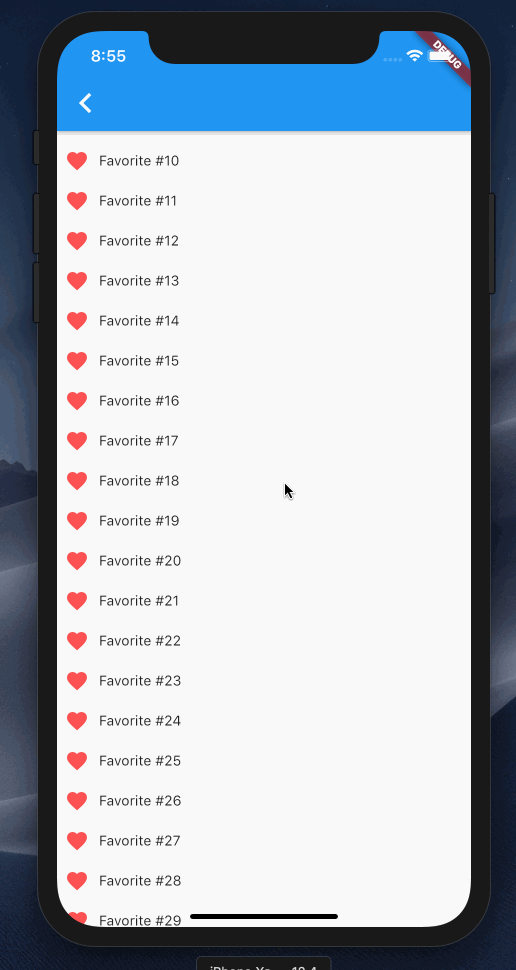

# Rendering a combined list view from multiple list using Flutter's `SliverList`s

The [previous post](https://timm.preetz.name/articles/nested-listviews-in-flutter) showed how to flatten grouped data with a header above the items so it can be rendered in a single [`ListView`](https://api.flutter.dev/flutter/widgets/ListView-class.html) widget. Now I want to look at a diffent use-case: Rendering lists from distinct data sources after each other. This implementation will use a [`CustomScrollView`](https://api.flutter.dev/flutter/widgets/CustomScrollView-class.html) and [`SliverList`s](https://api.flutter.dev/flutter/widgets/SliverList-class.html). If you're unfamiliar with slivers, I would recommend reading [Slivers, Demystified](https://medium.com/flutter/slivers-demystified-6ff68ab0296f) first, as the below example will just focus on this one narrow use-case, while the overall setup supports much more.

## The Example

For this demo I want to render a single list showing the user's favorite items, then some static content, and below that recommendations of similiar things. Since this simple example only has 3 row types, we could implement it using the `ListView` approach shown before. But as the row types are never mixed together and since in this example there are only 3 sections (favorites list, static content, recommendations list) I think it's a good case to create a widget for each section of the scroll view and then combine those into one scrollable list using `CustomScrollView`.




<div class="note">The demo app and code for is available on <a href="https://github.com/tp/nested_listviews">GitHub at tp/nested_listviews</a>.</div>

On the top-level, the widget that sets up the list as a `CustomScrollView` is nicely readable and gives a nice overview of what will be shown in it:

```dart
Widget build(BuildContext context) {
  return CustomScrollView(
    slivers: <Widget>[
      Favorites(),
      Static(),
      Recommendations(),
    ],
  );
}
```

Now onto each sliver itself:

* `Favorites` renders a `SliverList` with a `SliverChildBuilderDelegate`; so it could handle a large amount of items
* `Static` uses a `SliverChildListDelegate` in its `SliverList` as it renders just one very simple widget
* `Recommendations` uses the same approach a `Favorites`, just with a different widget for its rows

So the `Favorites` and `Recommendation` builder methods look both roughly like this:

```dart
Widget build(BuildContext context) {
  return SliverList(
    delegate: SliverChildBuilderDelegate(
      (context, index) {
        return XyzRow(data: index); // might be `data[index]` in practice
      },
      childCount: 100, // might be `data.length` in practice
    ),
  );
}
```

Overall [the whole source code for this example](https://github.com/tp/nested_listviews/blob/8220c3d768a094a85ed5cef7834137a010b02114/lib/slivers/list_from_slivers.dart) looks to me a lot simpler than what we had in the previous case even though it seems like a more niche use case than rendering a grouped list. I think that stems from the fact that this "lists below each other" is nicely supported by the framework, while the grouped display was not.

In a real app one might need to combine the 2 approaches: Render a grouped list view from a flattened list with a `SliverChildBuilderDelegate` inside a `CustomScrollView` which also contains other lists. That is left as an exercise to the interested reader though 😉

<div class="alert">👨🏾‍💻 If you love working with Flutter and like to dig deep to find the best approach to each problem, <a href="https://corporate.aboutyou.de/de/jobs/dart-developer-shop-applications">we might just have the perfect job for you</a>.</div>
