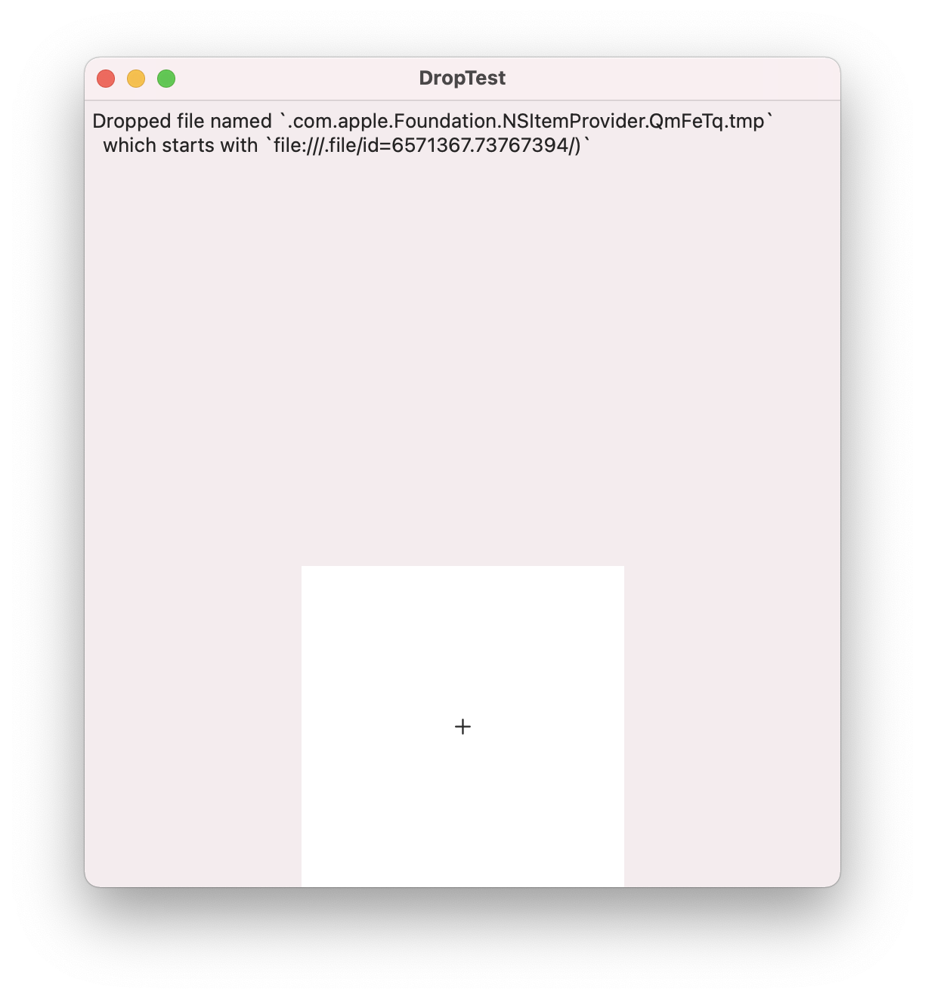
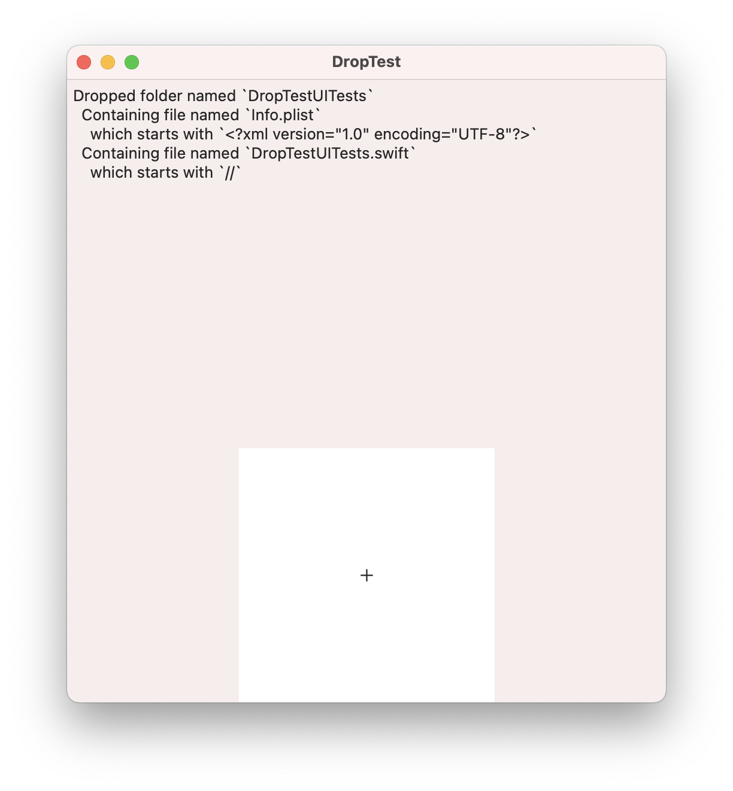

# Receiving File Drops on macOS (and iOS) with SwiftUI

<div class="note">A complete example of the code to be used on iOS and macOS is available <a href="https://github.com/tp/demo-FileDropTests">on GitHub here</a>.</div>

## Starting Point

<figure>
    
    <figcaption>Example of the drop behaviour on iOS/iPadOS</figcaption>
</figure>

While porting a pure `SwiftUI` app, I noticed that the `onDrop` file import handler used for the iOS app does not work as expected on macOS:

<figure>
    
    <figcaption>macOS app receiving a URL with a different path & content than the dragged file</figcaption>
</figure>

```swift
providers.first!.loadFileRepresentation(forTypeIdentifier: UTType.item.identifier) {
  url, _ in
    message = describeDroppedURL(url!)
}
```

At first I thought it was just an issue with file names being erased / hidden, e.g. `.com.apple.Foundation.NSItemProvider.MpBDqm.tmp` instead of `notes.txt`, but upon closer inspection the file contents were also different. Instead of the expected data, the file read from the initial URL contained another URL in the form of `file:///.file/id=6571367.2773272/`.

## Adaptation for macOS

Eventually I came to find out that these are known as [`File reference URL`s](https://developer.apple.com/library/archive/documentation/FileManagement/Conceptual/FileSystemProgrammingGuide/AccessingFilesandDirectories/AccessingFilesandDirectories.html#//apple_ref/doc/uid/TP40010672-CH3-SW6), and [this post](https://christiantietze.de/posts/2018/09/nsurl-filereferenceurl-swift/) offered a good reference on how they had to be handled historically (with `NSURL`), and that they should work out of the box with Swift's `URL`.

In order to avoid having the system to create temporary files which then need to be read & referenced to get to the final file, I switched the macOS implementation to read the dropped file URL from the `NSPasteboard` item itself:

```swift
providers.first!.loadObject(ofClass: NSPasteboard.PasteboardType.self) {
  pasteboardItem, _ in
    message = describeDroppedURL(URL(string: pasteboardItem!.rawValue)!)
}
```

<figure>
    
    <figcaption>macOS app after the updated: Being able to read the correct file name and contents</figcaption>
</figure>

## Bonus

One last finding I made during testing was that the dropped data was different from whether the item was dragged from within the Finder's tree view compared to when it was dragged from the title bar 🤔

<video src="./finder_drop_test.mov" autoplay="false">
 
Luckily the final implementation works just fine with either of these 🤗

